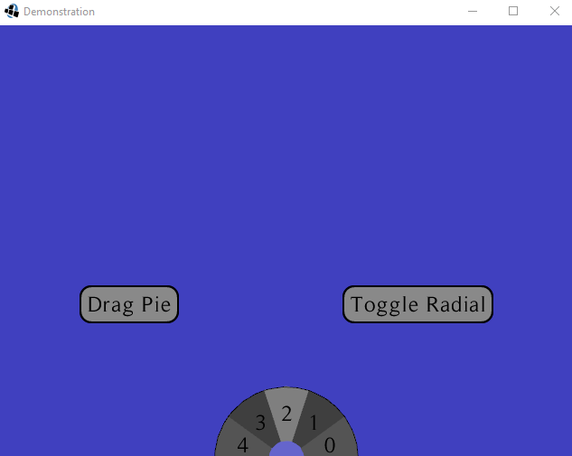
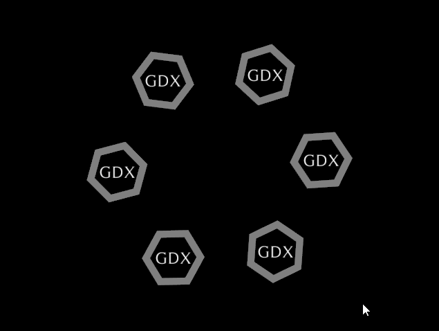
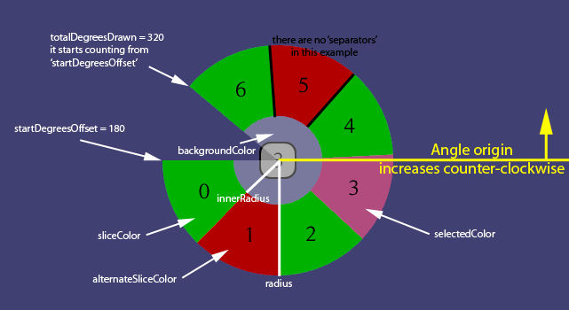

# PieMenu
[](https://jitpack.io/#payne911/PieMenu)
[](https://github.com/payne911/PieMenu/blob/master/LICENSE)
[](https://github.com/payne911/PieMenu/releases)


---

A library to obtain a circular WidgetGroup within [libGDX](https://libgdx.badlogicgames.com/), an open-source game development application framework written in Java.

It aims at providing users with the so-called `RadialGroup`: a simple container that places its children `Actors` in a circular fashion.

The more interesting feature might be the `PieMenu` class : it wraps the `RadialGroup` with a bunch of functionalities that allow assigning callback functions to listeners on the highlight and selection of items within the Group.

In terms of User Interface, circular context menus "are faster and more reliable to select from than linear menus, because selection depends on direction instead of distance" ([Wikipedia source](https://en.wikipedia.org/wiki/Pie_menu#Comparison_with_other_interaction_techniques)). That is the whole motivation behind this library.

## Table of Content
* [Demo](#demo)
  * [Basic widgets](#basic-widgets)
  * [Custom-animated widgets](#custom-animated-widgets)
* [Including in your project](#including-in-your-project)
* [Usage](#usage)
  * [Wiki](#wiki)
* [Final word](#final-word)
  * [Games showcases](#games-showcases)
  * [Contributing](#contributing)
  * [Thanks to](#thanks-to)
    * [Credits](#credits)

---

## Demo
First, let us demonstrate what you might be able to get out of this library (those are just examples and the variety of possiblities is much larger, if not endless).

### Basic widgets
**An [online demo](https://payne911.github.io/PieMenu/) is available.**



The trickier controls are:
* ``RIGHT-CLICK`` : opens a PieMenu meant for selection through dragging (don't release the right-click until you're done with your selection). It was configured to let you preview the selection's effect.
* ``MIDDLE-CLICK`` : opens a PieMenu meant for "normal" selection. You can release the button and select as you wish with a left-click.

If you want to check out the same demo, but within a `desktop` setup, check out [the Demonstration class](src/test/java/com/payne/games/piemenu/testMenu/otherTests/Demonstration.java). 

### Custom-animated widgets
You can also create your own animations:



It's surprisingly easy. Check out [the Animated Widget wiki page](https://github.com/payne911/PieMenu/wiki/Animated-widget/) to find out!

---

## Including in your project
To use this in your gradle project, add the version number and jitpack repository information to your root `build.gradle` file:

```groovy
allprojects {

    ext {
        ...
        pieMenuVersion = '5.0.0'  // add this line
    }
    
    repositories {
        ...
        maven { url 'https://jitpack.io' }  // add this line if it isn't there
    }
}
```

And  in your `core` project (still inside the root `build.gradle`) add the dependency:

```groovy
project(":core") {
    apply plugin: "java-library"

    dependencies {
        ...
        api "com.github.payne911:PieMenu:$pieMenuVersion"  // add this line
    }
}
```

See the [jitpack website](https://jitpack.io/#payne911/PieMenu) for more info.

**If you plan on releasing your project with an `html` ("HTML5/GWT") or `android` module, check out the [Wiki page on integration](https://github.com/payne911/PieMenu/wiki/Integrating-this-library).**

---

## Usage
The basic idea looks like this:

```java
/* Setting up and creating the widget. */
PieMenu.PieMenuStyle style = new PieMenu.PieMenuStyle();
style.sliceColor = new Color(.33f,.33f,.33f,1); // "style" variables affect the way the widget looks
PieMenu menu = new PieMenu(skin.getRegion("white"), style, 80); // "white" would be a 1x1 white pixel

/* Adding a listener. */
menu.addListener(new ChangeListener() {
    @Override
    public void changed(ChangeEvent event, Actor actor) {
        System.out.println("The selected index is: " + menu.getSelectedIndex());
    }
});

/* Populating the widget. */
for (int i = 0; i < 8; i++) {
    Label label = new Label(Integer.toString(i), skin);
    menu.addActor(label);
}

/* Including the Widget in the Stage. */
stage.addActor(menu);
```

And *voilà*!

### [Wiki](https://github.com/payne911/PieMenu/wiki)
This library offers you many types of behaviors related to pie-menus. Many of those are well-documented in the Wiki (with description, code and gif), so make sure to check it out.

More specifically, you might be interested in:
* **[Complete examples of code](https://github.com/payne911/PieMenu/wiki/Examples)**, along with textual descriptions of the expected behavior
* **[Understanding how to customize](https://github.com/payne911/PieMenu/wiki/Customizing-the-widget)** your widget's look and behavior.



---

## Final word
Very well: you've made it this far in the README! If you ever end up integrating this library into your cool projects, feel free to send a Pull Request of a GIF showcasing this library and with the name of your game; just make sure it's pushed in [the ``media/games`` folder](https://github.com/payne911/PieMenu/tree/master/media/games)!

### Games showcases
Here are a few GIFs of games that have integrated this library.

##### [Transfinite Dungeon](https://store.steampowered.com/app/1290750/Transfinite_Dungeon/), by icefill


##### [Hadal Calm](https://donpommelo.itch.io/hadal-calm), by donpommelo


### Contributing
If you feel like helping this library grow, make sure to check out [the Contributing](https://github.com/payne911/PieMenu/wiki/Contributing) Wiki page.

### Thanks to
* [EarlyGrey](https://github.com/earlygrey) (PieMenu is actually partly dependent on his library: [ShapeDrawer](https://github.com/earlygrey/shapedrawer))
* [raeleus](https://github.com/raeleus)
* [mgsx](https://github.com/mgsx-dev)
* [TEttinger](https://github.com/tommyettinger)
* Albert Pétoncle

For their sustained help through [the libGDX Discord channel](https://discord.gg/6pgDK9F). Their extensive knowledge was greatly appreciated.

#### Credits
I used some images from [Game-Icons.net](https://game-icons.net/), more specifically the 5 icons displayed when clicking the "Toggle Radial" button. To be even more specific, the credits go to [Lorc](http://lorcblog.blogspot.com/). Those are under the [CC BY 3.0 license](https://creativecommons.org/licenses/by/3.0/) license.

Also, [raeleus](https://github.com/raeleus) made the background image for the "middle-click menu" (which is also used in this library's logo), and the test application uses the [Plain James UI Skin](https://github.com/raeleus/Plain-James-UI) created by Raymond "Raeleus" Buckley under the [CC BY 4.0 license](https://creativecommons.org/licenses/by/4.0/). [Check out the others!](https://ray3k.wordpress.com/artwork/)

The structure and build scripts of this repository were strongly inspired by [RafaSKB](https://github.com/rafaskb)'s [typing-label](https://github.com/rafaskb/typing-label) library.

Parts of this README were lazily copied and adapted from EarlyGrey's library (with his agreement). Cheers!
